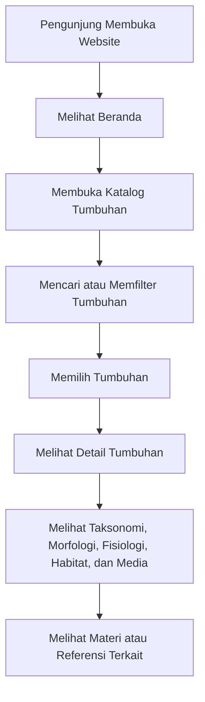
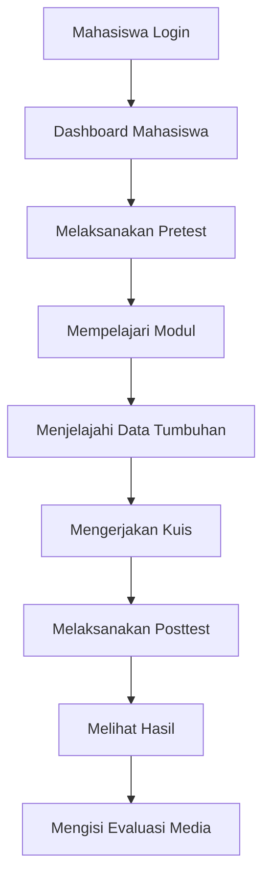
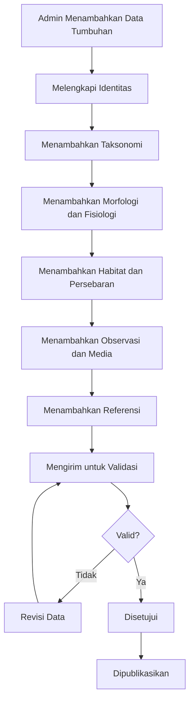
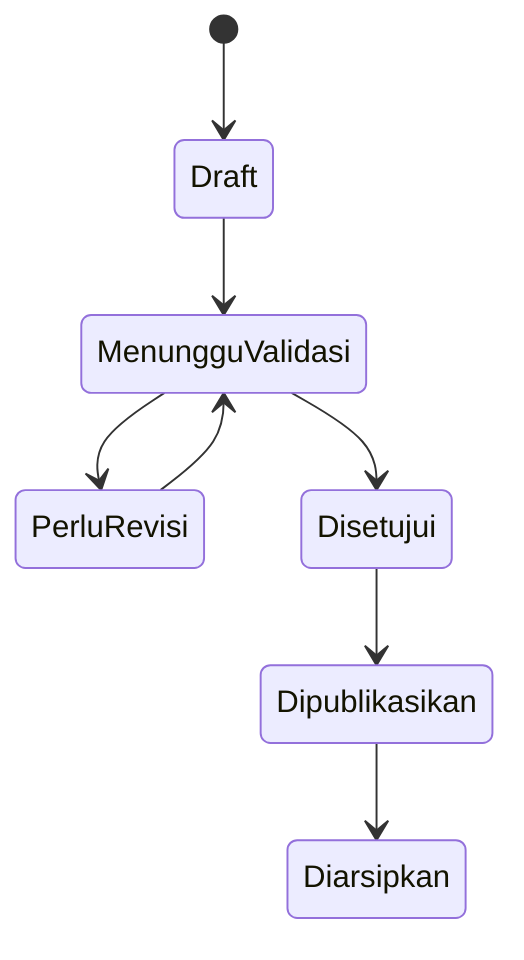
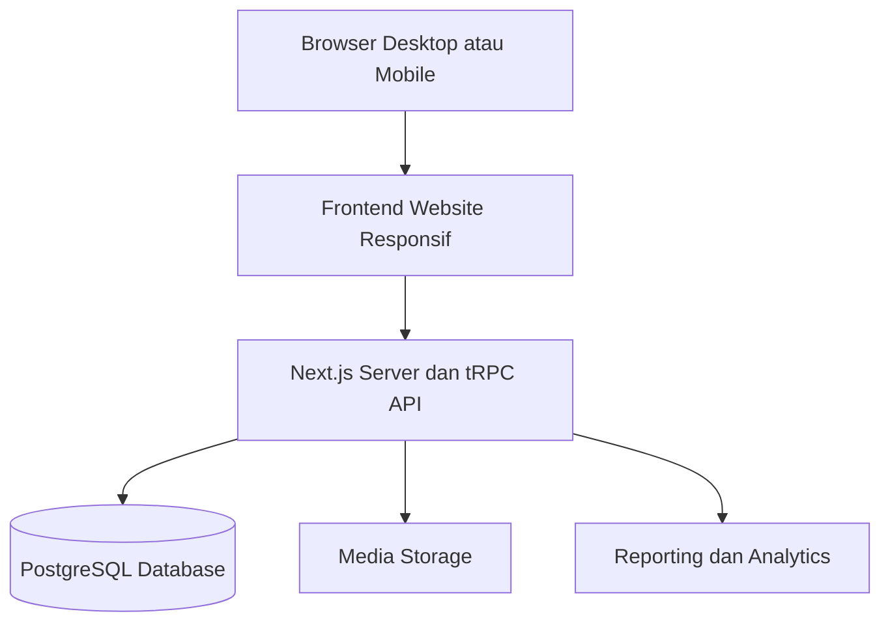
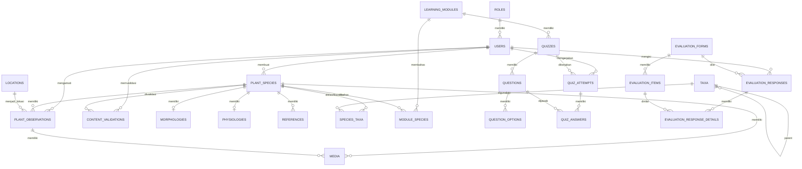

# Sistem Informasi Botani Phanerogamae Berbasis Web

Sistem Informasi Botani Phanerogamae merupakan platform berbasis web yang dikembangkan sebagai **basis data tumbuhan, media pembelajaran digital, sarana eksplorasi botani, dan instrumen evaluasi pembelajaran** bagi mahasiswa Biologi.

Website ini menggabungkan konsep:

- Digital herbarium
- Ensiklopedia tumbuhan
- Modul pembelajaran
- Katalog hasil observasi
- Pretest, kuis, dan posttest
- Validasi ahli materi dan ahli media
- Evaluasi kelayakan serta efektivitas penggunaan website

Sistem difokuskan pada tumbuhan **Phanerogamae**, yaitu tumbuhan berbiji yang mencakup kelompok **Gymnospermae** dan **Angiospermae**.

---

## 1. Latar Belakang

Pembelajaran Botani Phanerogamae masih menghadapi beberapa kendala, antara lain:

- Materi pembelajaran masih banyak bergantung pada modul konvensional.
- Informasi mengenai tumbuhan lokal belum tersusun secara terintegrasi.
- Tidak semua spesies tumbuhan mudah ditemukan saat praktikum lapangan.
- Kegiatan observasi langsung membutuhkan biaya, waktu, dan akses lokasi.
- Mahasiswa membutuhkan media pembelajaran yang dapat diakses kapan saja.
- Informasi morfologi, fisiologi, habitat, klasifikasi, dan manfaat tumbuhan masih tersebar pada berbagai sumber.

Sistem ini dirancang untuk mendigitalisasi informasi tumbuhan dan menyajikannya dalam bentuk yang sistematis, interaktif, mudah diakses, dan dapat digunakan dalam kegiatan akademik maupun penelitian.

---

## 2. Tujuan Sistem

Sistem ini dikembangkan untuk:

1. Menyediakan informasi Botani Phanerogamae secara terstruktur.
2. Membantu mahasiswa memahami klasifikasi, morfologi, fisiologi, habitat, dan manfaat tumbuhan.
3. Menyediakan media pembelajaran berbasis web yang responsif.
4. Mendokumentasikan hasil observasi tumbuhan di lapangan.
5. Menyediakan pretest, kuis, dan posttest sebagai evaluasi pembelajaran.
6. Memfasilitasi validasi materi oleh ahli.
7. Mengukur kelayakan media dan efektivitas pembelajaran.
8. Mendukung pembelajaran sepanjang hayat dan pendidikan berkualitas.
9. Menjadi fondasi pengembangan digital herbarium tumbuhan Sumatera Utara.

---

## 3. Konsep Utama Website

Website dibangun menggunakan empat konsep utama.

### 3.1 Basis Data Tumbuhan

Menyimpan informasi:

- Nama lokal
- Nama Indonesia
- Nama ilmiah
- Sinonim
- Klasifikasi taksonomi
- Kelompok Gymnospermae atau Angiospermae
- Kelompok monokotil atau dikotil
- Morfologi
- Fisiologi
- Habitat
- Persebaran
- Manfaat
- Dokumentasi
- Referensi ilmiah

### 3.2 Media Pembelajaran

Menyediakan:

- Modul Botani Phanerogamae
- Materi klasifikasi tumbuhan
- Materi morfologi dan fisiologi
- Glosarium istilah botani
- Ringkasan materi
- Latihan soal
- Pretest
- Kuis
- Posttest
- Riwayat hasil belajar

### 3.3 Digital Herbarium dan Observasi

Menyimpan data hasil observasi seperti:

- Spesies tumbuhan
- Tanggal observasi
- Nama pengamat
- Lokasi
- Koordinat
- Kondisi habitat
- Catatan lapangan
- Foto dokumentasi
- Status verifikasi

### 3.4 Instrumen Penelitian

Mendukung kegiatan:

- Validasi ahli materi
- Validasi ahli media
- Uji coba skala kecil
- Uji coba skala sedang
- Uji coba lapangan
- Evaluasi pengguna
- Pengukuran efektivitas pembelajaran
- Analisis nilai pretest dan posttest

---

## 4. Aktor dan Hak Akses

Sistem memiliki beberapa jenis pengguna.

| Aktor          | Hak Akses Utama                                                         |
| -------------- | ----------------------------------------------------------------------- |
| Pengunjung     | Melihat katalog, detail tumbuhan, materi umum                           |
| Mahasiswa      | Mengakses materi, mengerjakan kuis, melihat nilai, dan mengisi evaluasi |
| Dosen          | Melihat materi, memantau hasil mahasiswa, dan memberikan masukan        |
| Validator Ahli | Memvalidasi substansi materi atau kualitas media                        |
| Administrator  | Mengelola seluruh data, pengguna, konten, evaluasi, dan publikasi       |
| Peneliti       | Melihat data evaluasi, hasil uji coba, dan laporan penelitian           |

### Matriks Hak Akses

| Fitur                      | Pengunjung | Mahasiswa |    Dosen | Validator | Admin |
| -------------------------- | ---------: | --------: | -------: | --------: | ----: |
| Melihat katalog tumbuhan   |         Ya |        Ya |       Ya |        Ya |    Ya |
| Melihat detail tumbuhan    |         Ya |        Ya |       Ya |        Ya |    Ya |
| Mengakses materi umum      |         Ya |        Ya |       Ya |        Ya |    Ya |
| Mengerjakan kuis           |      Tidak |        Ya | Opsional |     Tidak |    Ya |
| Melihat nilai pribadi      |      Tidak |        Ya |    Tidak |     Tidak |    Ya |
| Melihat hasil kelas        |      Tidak |     Tidak |       Ya |     Tidak |    Ya |
| Memvalidasi konten         |      Tidak |     Tidak | Opsional |        Ya |    Ya |
| Mengelola tumbuhan         |      Tidak |     Tidak |    Tidak |     Tidak |    Ya |
| Mengelola pengguna         |      Tidak |     Tidak |    Tidak |     Tidak |    Ya |
| Melihat laporan penelitian |      Tidak |     Tidak | Opsional |  Opsional |    Ya |

---

## 5. Ruang Lingkup Fitur

### 5.1 Fitur Publik

- Beranda
- Tentang sistem
- Katalog tumbuhan
- Pencarian tumbuhan
- Filter berdasarkan klasifikasi
- Filter berdasarkan lokasi
- Detail tumbuhan
- Galeri tumbuhan
- Materi umum
- Glosarium
- Referensi
- Kontak

### 5.2 Fitur Mahasiswa

- Registrasi dan login
- Dashboard mahasiswa
- Materi pembelajaran
- Pretest
- Kuis
- Posttest
- Riwayat nilai
- Progres pembelajaran
- Tumbuhan favorit
- Riwayat akses
- Evaluasi media
- Umpan balik

### 5.3 Fitur Dosen

- Dashboard dosen
- Daftar mahasiswa
- Statistik nilai
- Hasil pretest dan posttest
- Hasil kuis
- Rekap progres pembelajaran
- Umpan balik terhadap materi

### 5.4 Fitur Validator

- Daftar konten menunggu validasi
- Validasi ahli materi
- Validasi ahli media
- Pemberian skor
- Pemberian catatan revisi
- Persetujuan atau penolakan konten
- Riwayat validasi

### 5.5 Fitur Administrator

- Dashboard statistik
- Manajemen pengguna
- Manajemen peran
- Manajemen tumbuhan
- Manajemen taksonomi
- Manajemen morfologi
- Manajemen fisiologi
- Manajemen lokasi
- Manajemen observasi
- Manajemen media
- Manajemen referensi
- Manajemen materi
- Manajemen kuis
- Manajemen evaluasi
- Validasi dan publikasi konten
- Ekspor laporan
- Audit log
- Backup data

---

## 6. Struktur Navigasi

```text
Beranda
├── Jelajahi Tumbuhan
│   ├── Semua Tumbuhan
│   ├── Gymnospermae
│   ├── Angiospermae
│   ├── Monokotil
│   ├── Dikotil
│   ├── Berdasarkan Famili
│   └── Berdasarkan Lokasi
├── Materi Pembelajaran
│   ├── Pengenalan Phanerogamae
│   ├── Gymnospermae
│   ├── Angiospermae
│   ├── Morfologi Tumbuhan
│   ├── Fisiologi Tumbuhan
│   └── Glosarium
├── Observasi
│   ├── Lokasi Observasi
│   ├── Koleksi Lapangan
│   └── Galeri
├── Evaluasi
│   ├── Pretest
│   ├── Kuis
│   └── Posttest
├── Tentang
│   ├── Tentang Penelitian
│   ├── Tim Pengembang
│   └── Kontak
└── Akun
    ├── Login
    ├── Dashboard
    ├── Progres Belajar
    └── Riwayat Nilai
```

---

## 7. Alur Sistem

### 7.1 Alur Pengunjung



### 7.2 Alur Mahasiswa



### 7.3 Alur Pengelolaan Data Tumbuhan



### 7.4 Status Konten



---

## 8. Arsitektur Sistem

Untuk tahap awal, sistem disarankan menggunakan arsitektur **monolit modular** agar lebih mudah dikembangkan, diuji, dan dipelihara.



### Komponen Arsitektur

1. **Frontend**
   - Menampilkan antarmuka pengguna.
   - Responsif untuk desktop, tablet, dan perangkat seluler.
   - Berkomunikasi dengan backend melalui tRPC yang type-safe.

2. **Backend**
   - Menangani autentikasi.
   - Menangani logika bisnis.
   - Menyediakan API.
   - Mengelola validasi dan publikasi data.
   - Mengelola kuis dan evaluasi.

3. **Database**
   - Menyimpan data pengguna.
   - Menyimpan data tumbuhan.
   - Menyimpan data observasi.
   - Menyimpan hasil kuis.
   - Menyimpan hasil evaluasi.

4. **Media Storage**
   - Menyimpan foto tumbuhan.
   - Menyimpan ilustrasi.
   - Menyimpan dokumen pendukung.
   - Database hanya menyimpan path atau URL file.

---

## 9. Teknologi Implementasi

### Stack Utama

| Bagian          | Teknologi                              |
| --------------- | -------------------------------------- |
| Frontend        | React 19 dan Next.js 16 App Router     |
| Backend         | Next.js Server Components dan tRPC 11  |
| ORM             | Drizzle ORM                            |
| Database        | Supabase PostgreSQL                    |
| Styling         | Tailwind CSS 4                         |
| Authentication  | Supabase Auth                          |
| API             | tRPC                                   |
| Media Storage   | Supabase Storage                       |
| Deployment      | Vercel                                 |
| Version Control | GitHub                                 |

---

## 10. Skema Basis Data

### 10.1 Entity Relationship Diagram



---

## 11. Detail Tabel Utama

### 11.1 `roles`

| Kolom       | Tipe      | Keterangan       |
| ----------- | --------- | ---------------- |
| id          | bigint    | Primary key      |
| name        | varchar   | Nama peran       |
| description | text      | Deskripsi peran  |
| created_at  | timestamp | Waktu dibuat     |
| updated_at  | timestamp | Waktu diperbarui |

### 11.2 `users`

| Kolom       | Tipe      | Keterangan           |
| ----------- | --------- | -------------------- |
| id          | bigint    | Primary key          |
| role_id     | bigint    | Foreign key ke roles |
| name        | varchar   | Nama pengguna        |
| email       | varchar   | Email unik           |
| password    | varchar   | Password terenkripsi |
| institution | varchar   | Institusi            |
| status      | varchar   | active atau inactive |
| created_at  | timestamp | Waktu dibuat         |
| updated_at  | timestamp | Waktu diperbarui     |

### 11.3 `plant_species`

| Kolom               | Tipe      | Keterangan                             |
| ------------------- | --------- | -------------------------------------- |
| id                  | bigint    | Primary key                            |
| code                | varchar   | Kode unik, contoh flora_001            |
| slug                | varchar   | URL unik                               |
| local_name          | varchar   | Nama lokal                             |
| indonesian_name     | varchar   | Nama Indonesia                         |
| scientific_name     | varchar   | Nama ilmiah                            |
| author_name         | varchar   | Nama author taksonomi                  |
| synonym             | text      | Sinonim                                |
| group_type          | varchar   | Gymnospermae atau Angiospermae         |
| cotyledon_type      | varchar   | Monokotil, dikotil, atau tidak berlaku |
| general_description | text      | Deskripsi umum                         |
| habitat             | text      | Habitat                                |
| distribution        | text      | Persebaran                             |
| benefits            | text      | Manfaat                                |
| status              | varchar   | Status publikasi                       |
| created_by          | bigint    | Pembuat data                           |
| reviewed_by         | bigint    | Validator terakhir                     |
| published_at        | timestamp | Waktu publikasi                        |
| created_at          | timestamp | Waktu dibuat                           |
| updated_at          | timestamp | Waktu diperbarui                       |

### 11.4 `taxa`

| Kolom       | Tipe    | Keterangan                                           |
| ----------- | ------- | ---------------------------------------------------- |
| id          | bigint  | Primary key                                          |
| parent_id   | bigint  | Parent takson                                        |
| name        | varchar | Nama takson                                          |
| rank        | varchar | Kingdom, divisi, kelas, ordo, famili, genus, spesies |
| description | text    | Keterangan                                           |

Struktur `parent_id` digunakan agar hierarki taksonomi bersifat fleksibel.

### 11.5 `species_taxa`

| Kolom      | Tipe   | Keterangan                   |
| ---------- | ------ | ---------------------------- |
| id         | bigint | Primary key                  |
| species_id | bigint | Foreign key ke plant_species |
| taxon_id   | bigint | Foreign key ke taxa          |

### 11.6 `morphologies`

| Kolom                   | Tipe   | Keterangan       |
| ----------------------- | ------ | ---------------- |
| id                      | bigint | Primary key      |
| species_id              | bigint | Foreign key      |
| root                    | text   | Deskripsi akar   |
| stem                    | text   | Deskripsi batang |
| leaf                    | text   | Deskripsi daun   |
| flower                  | text   | Deskripsi bunga  |
| fruit                   | text   | Deskripsi buah   |
| seed                    | text   | Deskripsi biji   |
| special_characteristics | text   | Ciri khusus      |

### 11.7 `physiologies`

| Kolom                  | Tipe   | Keterangan           |
| ---------------------- | ------ | -------------------- |
| id                     | bigint | Primary key          |
| species_id             | bigint | Foreign key          |
| reproduction           | text   | Informasi reproduksi |
| growth                 | text   | Pertumbuhan          |
| environmental_response | text   | Respons lingkungan   |
| adaptation             | text   | Adaptasi             |
| additional_information | text   | Informasi tambahan   |

### 11.8 `locations`

| Kolom         | Tipe    | Keterangan          |
| ------------- | ------- | ------------------- |
| id            | bigint  | Primary key         |
| location_name | varchar | Nama lokasi         |
| village       | varchar | Desa atau kelurahan |
| district      | varchar | Kecamatan           |
| regency       | varchar | Kabupaten atau kota |
| province      | varchar | Provinsi            |
| latitude      | decimal | Garis lintang       |
| longitude     | decimal | Garis bujur         |
| description   | text    | Keterangan          |

### 11.9 `plant_observations`

| Kolom               | Tipe    | Keterangan           |
| ------------------- | ------- | -------------------- |
| id                  | bigint  | Primary key          |
| species_id          | bigint  | Spesies yang diamati |
| location_id         | bigint  | Lokasi               |
| observer_id         | bigint  | Pengamat             |
| observation_date    | date    | Tanggal observasi    |
| habitat_condition   | text    | Kondisi habitat      |
| notes               | text    | Catatan              |
| verification_status | varchar | Status verifikasi    |

### 11.10 `media`

| Kolom          | Tipe    | Keterangan                 |
| -------------- | ------- | -------------------------- |
| id             | bigint  | Primary key                |
| species_id     | bigint  | Spesies                    |
| observation_id | bigint  | Observasi terkait          |
| filename       | varchar | Nama file                  |
| file_path      | varchar | Path file                  |
| media_type     | varchar | image, diagram, atau video |
| caption        | text    | Keterangan                 |
| photographer   | varchar | Pengambil gambar           |
| is_primary     | boolean | Foto utama                 |

### 11.11 `references`

| Kolom                | Tipe    | Keterangan           |
| -------------------- | ------- | -------------------- |
| id                   | bigint  | Primary key          |
| species_id           | bigint  | Spesies terkait      |
| title                | text    | Judul sumber         |
| authors              | text    | Penulis              |
| year                 | integer | Tahun                |
| journal_or_publisher | varchar | Jurnal atau penerbit |
| doi_or_url           | text    | DOI atau URL         |
| citation_text        | text    | Format sitasi        |

---

## 12. Skema Modul Pembelajaran

### 12.1 `learning_modules`

| Kolom               | Keterangan           |
| ------------------- | -------------------- |
| id                  | Primary key          |
| title               | Judul modul          |
| slug                | URL modul            |
| description         | Deskripsi            |
| learning_objectives | Tujuan pembelajaran  |
| content             | Isi materi           |
| module_order        | Urutan modul         |
| status              | Draft atau published |
| created_by          | Pembuat              |

### 12.2 `module_species`

Menghubungkan modul dengan spesies yang dibahas.

| Kolom      | Keterangan  |
| ---------- | ----------- |
| id         | Primary key |
| module_id  | ID modul    |
| species_id | ID spesies  |

### 12.3 `quizzes`

| Kolom         | Keterangan                 |
| ------------- | -------------------------- |
| id            | Primary key                |
| module_id     | Modul terkait              |
| title         | Judul kuis                 |
| quiz_type     | Pretest, latihan, posttest |
| passing_score | Nilai kelulusan            |
| duration      | Durasi                     |
| status        | Status publikasi           |

### 12.4 `questions`

| Kolom         | Keterangan                     |
| ------------- | ------------------------------ |
| id            | Primary key                    |
| quiz_id       | ID kuis                        |
| question_text | Pertanyaan                     |
| question_type | Pilihan ganda atau benar-salah |
| image_path    | Gambar soal                    |
| score_weight  | Bobot nilai                    |

### 12.5 `question_options`

| Kolom       | Keterangan            |
| ----------- | --------------------- |
| id          | Primary key           |
| question_id | ID soal               |
| option_text | Pilihan jawaban       |
| is_correct  | Penanda jawaban benar |

### 12.6 `quiz_attempts`

| Kolom          | Keterangan    |
| -------------- | ------------- |
| id             | Primary key   |
| user_id        | Mahasiswa     |
| quiz_id        | Kuis          |
| started_at     | Waktu mulai   |
| completed_at   | Waktu selesai |
| score          | Nilai         |
| total_correct  | Jumlah benar  |
| attempt_number | Percobaan ke  |

### 12.7 `quiz_answers`

| Kolom              | Keterangan       |
| ------------------ | ---------------- |
| id                 | Primary key      |
| attempt_id         | Percobaan        |
| question_id        | Soal             |
| selected_option_id | Jawaban          |
| is_correct         | Benar atau salah |
| score_received     | Nilai diperoleh  |

---

## 13. Skema Evaluasi Penelitian

### 13.1 Jenis Evaluasi

- Validasi ahli materi
- Validasi ahli media
- Evaluasi mahasiswa
- Uji usability
- Uji efektivitas
- Uji skala kecil
- Uji skala sedang
- Uji lapangan

### 13.2 `evaluation_forms`

| Kolom           | Keterangan                              |
| --------------- | --------------------------------------- |
| id              | Primary key                             |
| title           | Nama formulir                           |
| evaluation_type | Jenis evaluasi                          |
| respondent_type | Mahasiswa, ahli materi, atau ahli media |
| description     | Deskripsi                               |

### 13.3 `evaluation_items`

| Kolom     | Keterangan                                  |
| --------- | ------------------------------------------- |
| id        | Primary key                                 |
| form_id   | Formulir                                    |
| aspect    | Materi, media, usability, atau pembelajaran |
| statement | Pernyataan                                  |
| scale_min | Skor minimum                                |
| scale_max | Skor maksimum                               |

### 13.4 `evaluation_responses`

| Kolom         | Keterangan                |
| ------------- | ------------------------- |
| id            | Primary key               |
| form_id       | Formulir                  |
| respondent_id | Responden                 |
| trial_stage   | small, medium, atau field |
| total_score   | Total skor                |
| comments      | Komentar                  |
| submitted_at  | Waktu pengisian           |

### 13.5 `evaluation_response_details`

| Kolom       | Keterangan       |
| ----------- | ---------------- |
| id          | Primary key      |
| response_id | Jawaban evaluasi |
| item_id     | Pernyataan       |
| score       | Skor             |
| note        | Catatan          |

---

## 14. Skema Validasi Konten

### `content_validations`

| Kolom           | Keterangan                   |
| --------------- | ---------------------------- |
| id              | Primary key                  |
| species_id      | Tumbuhan yang divalidasi     |
| validator_id    | Validator                    |
| validation_type | Materi atau media            |
| score           | Skor                         |
| decision        | Approved, revision, rejected |
| notes           | Catatan                      |
| validated_at    | Waktu validasi               |

### Alur Validasi

```text
Draft
→ Dikirim untuk validasi
→ Diperiksa ahli
→ Revisi apabila belum sesuai
→ Dikirim kembali
→ Disetujui
→ Dipublikasikan
```

---

## 15. Contoh Struktur Data JSON

```json
{
  "id": "flora_001",
  "slug": "salak",
  "nama": "Salak",
  "nama_ilmiah": "Salacca zalacca",
  "kelompok": {
    "biji": "Angiospermae",
    "kotiledon": "Monokotil"
  },
  "taksonomi": {
    "kingdom": "Plantae",
    "ordo": "Arecales",
    "famili": "Arecaceae",
    "genus": "Salacca",
    "spesies": "Salacca zalacca"
  },
  "morfologi": {
    "akar": "Deskripsi akar",
    "batang": "Deskripsi batang",
    "daun": "Deskripsi daun",
    "bunga": "Deskripsi bunga",
    "buah": "Deskripsi buah",
    "biji": "Deskripsi biji"
  },
  "fisiologi": {
    "reproduksi": "Deskripsi reproduksi",
    "adaptasi": "Deskripsi adaptasi"
  },
  "habitat": "Deskripsi habitat",
  "observasi": [
    {
      "tanggal": "2026-01-15",
      "lokasi": {
        "kabupaten": "Simalungun",
        "provinsi": "Sumatera Utara"
      },
      "catatan": "Catatan observasi"
    }
  ],
  "media": [
    {
      "filename": "salak_001.jpg",
      "url": "/storage/images/salak_001.jpg",
      "caption": "Dokumentasi tanaman salak"
    }
  ],
  "referensi": [],
  "status": "published"
}
```

---

## 16. Rancangan Endpoint API

### Authentication

```text
POST   /api/auth/register
POST   /api/auth/login
POST   /api/auth/logout
GET    /api/auth/me
```

### Tumbuhan

```text
GET    /api/plants
GET    /api/plants/{slug}
POST   /api/plants
PUT    /api/plants/{id}
DELETE /api/plants/{id}
POST   /api/plants/{id}/submit-validation
POST   /api/plants/{id}/publish
```

### Taksonomi

```text
GET    /api/taxa
GET    /api/taxa/{id}
POST   /api/taxa
PUT    /api/taxa/{id}
DELETE /api/taxa/{id}
```

### Observasi

```text
GET    /api/observations
GET    /api/observations/{id}
POST   /api/observations
PUT    /api/observations/{id}
DELETE /api/observations/{id}
```

### Lokasi

```text
GET    /api/locations
POST   /api/locations
PUT    /api/locations/{id}
DELETE /api/locations/{id}
```

### Materi

```text
GET    /api/modules
GET    /api/modules/{slug}
POST   /api/modules
PUT    /api/modules/{id}
DELETE /api/modules/{id}
```

### Kuis

```text
GET    /api/quizzes/{id}
POST   /api/quizzes/{id}/start
POST   /api/quizzes/{id}/submit
GET    /api/quiz-attempts/me
```

### Evaluasi

```text
GET    /api/evaluation-forms
POST   /api/evaluation-responses
GET    /api/evaluation-results
```

### Validasi

```text
GET    /api/validations/pending
POST   /api/validations/{speciesId}
GET    /api/validations/history
```

## 18. Halaman Utama yang Harus Dibangun

### Halaman Publik

1. Beranda
2. Katalog tumbuhan
3. Detail tumbuhan
4. Daftar klasifikasi
5. Daftar lokasi observasi
6. Materi pembelajaran
7. Glosarium
8. Login dan registrasi

### Halaman Mahasiswa

1. Dashboard
2. Daftar materi
3. Detail materi
4. Pretest
5. Kuis
6. Posttest
7. Riwayat nilai
8. Progres pembelajaran
9. Form evaluasi

### Halaman Admin

1. Dashboard admin
2. Data tumbuhan
3. Form tambah tumbuhan
4. Data taksonomi
5. Data observasi
6. Data lokasi
7. Manajemen media
8. Manajemen materi
9. Manajemen kuis
10. Manajemen evaluasi
11. Manajemen pengguna
12. Validasi dan publikasi
13. Laporan
14. Audit log

---

## 19. Rancangan Halaman Detail Tumbuhan

Halaman detail tumbuhan sebaiknya memiliki bagian:

1. Hero atau identitas tumbuhan
2. Nama lokal dan nama ilmiah
3. Foto utama
4. Status klasifikasi
5. Taksonomi
6. Deskripsi umum
7. Morfologi
8. Fisiologi
9. Habitat
10. Persebaran
11. Manfaat
12. Lokasi observasi
13. Galeri
14. Referensi ilmiah
15. Materi terkait
16. Kuis terkait

---

## 20. Pencarian dan Filter

Pencarian dapat dilakukan berdasarkan:

- Nama lokal
- Nama Indonesia
- Nama ilmiah
- Genus
- Famili
- Ordo
- Kelompok tumbuhan
- Jenis kotiledon
- Lokasi
- Habitat
- Manfaat

Contoh parameter:

```text
/plants?search=salak
/plants?family=Arecaceae
/plants?group=Angiospermae
/plants?cotyledon=Monokotil
/plants?regency=Simalungun
```

---

## 22. Keamanan Sistem

Keamanan minimum yang perlu diterapkan:

- Password hashing
- Role-based access control
- Validasi input
- Proteksi CSRF
- Proteksi XSS
- Proteksi SQL injection melalui ORM
- Pembatasan ukuran dan jenis file
- Penamaan file unik
- Audit log
- Backup database
- Rate limiting
- Session timeout
- Pembatasan akses halaman administrasi

---

## 23. Aturan Data Ilmiah

1. Nama ilmiah ditulis sesuai kaidah nomenklatur.
2. Genus dan spesies ditulis miring pada antarmuka.
3. Setiap data wajib memiliki sumber.
4. Foto harus memiliki informasi pemilik atau pengambil gambar.
5. Konten belum dapat dipublikasikan sebelum validasi (jadi pakai verification).
6. Data observasi tidak boleh menggantikan data utama spesies.
7. Satu spesies dapat memiliki banyak observasi.
8. Satu observasi dapat memiliki banyak media.
9. Riwayat perubahan konten harus disimpan.
10. Data yang tidak valid dapat diarsipkan tanpa dihapus permanen.

---

## 29. Konvensi Status Data

### Status Tumbuhan

```text
draft
pending_validation
revision_required
approved
published
archived
```

### Status Observasi

```text
unverified
verified
rejected
```

### Status Pengguna

```text
active
inactive
suspended
```

### Jenis Kuis

```text
pretest
practice
posttest
final_evaluation
```

### Tahap Uji Coba

```text
small
medium
field
```

---

## 30. Konvensi Penamaan

### Database

- Gunakan `snake_case`.
- Nama tabel menggunakan bentuk jamak.
- Foreign key menggunakan pola `{entity}_id`.

Contoh:

```text
plant_species
plant_observations
learning_modules
quiz_attempts
evaluation_responses
```

### API

- Gunakan bentuk jamak.
- Gunakan slug untuk URL publik.
- Gunakan ID untuk kebutuhan administrasi.

Contoh:

```text
/api/plants
/api/plants/{id}
/tumbuhan/{slug}
```

---
